# 🧠⚡ BrainJuice - Dubai Real Estate Explorer

> **Enterprise-grade AI real estate platform leveraging voice-driven conversational intelligence with immersive 3D mapping for comprehensive Dubai property exploration**

[](https://react.dev/)
[](https://www.typescriptlang.org/)
[](https://vitejs.dev/)
[](https://ai.google.dev/)
[](https://developers.google.com/maps)
[](https://opensource.org/licenses/Apache-2.0)

---

## 📋 Table of Contents

- [Overview](#-overview)
- [Architecture](#-architecture)
- [Features & EPICS](#-features--epics)
- [Project Structure](#-project-structure)
- [Core Components](#-core-components)
- [Technologies](#-technologies-used)
- [Prerequisites](#-prerequisites)
- [Installation](#-installation)
- [Configuration](#-configuration)
- [Usage](#-usage)
- [API Integration](#-api-integration)
- [Cost Management](#-cost-management)
- [Security](#-security)
- [Testing](#-testing)
- [Deployment](#-deployment)
- [Troubleshooting](#-troubleshooting)
- [Contributing](#-contributing)
- [License](#-license)

---

## 🎯 Overview

**BrainJuice** is an advanced, production-ready AI-powered real estate exploration platform that transforms Dubai property discovery into an immersive, conversational experience using Google's Gemini AI with real-time 3D visualization, voice interaction, and expert market guidance.

### 🌟 Key Highlights

- **Voice-Driven Intelligence**: Natural language conversations powered by Gemini Live API with real-time audio streaming
- **Photorealistic 3D Maps**: Immersive visualization of Dubai communities using Google Maps 3D technology
- **AI Real Estate Advisor**: Specialized knowledge of Dubai market, regulations, investment processes, and visa requirements
- **Interactive Discovery**: Dynamic community exploration with property markers and amenity search
- **Grounding with Maps**: AI responses enriched with real-time Google Maps data for accuracy
- **Expert Domain Knowledge**: Integrated BrainJuice KnowledgeBank with comprehensive Dubai real estate insights
- **Multi-Tool Architecture**: Function-calling capabilities for community location, project discovery, and amenity search
- **Real-Time Processing**: Seamless audio streaming with instant transcription and response generation
- **Professional Guidance**: Authoritative information aligned with Dubai Land Department (DLD) standards

### 🎓 Use Cases

- **Property Investment**: Explore investment opportunities with market trends and developer insights
- **Community Discovery**: Virtually tour Dubai's master-planned communities in immersive 3D
- **Market Research**: Access real-time data on property prices, rental yields, and market dynamics
- **Investment Planning**: Understand buying processes, visa requirements, and legal regulations
- **Amenity Search**: Discover nearby schools, hospitals, malls, and restaurants around properties
- **Developer Research**: Learn about major developers, their reputation, and project portfolios
- **Rental Market Analysis**: Understand tenant rights, rental regulations, and market rates

---

## 🗺️ Architecture

### System Architecture Diagram

```mermaid
graph TB
    subgraph "Frontend Layer - React + TypeScript"
        UI[Main App Component]
        ControlUI[Control Tray - Mic/Input]
        ConsoleUI[Streaming Console]
        SidebarUI[Settings Sidebar]
        Map3DUI[3D Map Component]
        PopupUI[Popup Modals]
    end
    
    subgraph "State Management - Zustand"
        MapState[Map Store<br/>- Markers<br/>- Camera Target<br/>- Routes]
        LogState[Log Store<br/>- Transcriptions<br/>- Messages]
        SettingsState[Settings Store<br/>- Voice<br/>- Model<br/>- Tools]
    end
    
    subgraph "Context Layer"
        LiveAPICtx[LiveAPI Context<br/>Gemini Connection Manager]
    end
    
    subgraph "Business Logic Layer"
        LiveAPIHook[useLiveAPI Hook<br/>Connection & Event Handling]
        MapController[Map Controller<br/>Camera & Marker Control]
        AudioRecorder[Audio Recorder<br/>Microphone Input]
        AudioStreamer[Audio Streamer<br/>Voice Output]
    end
    
    subgraph "API Integration Layer"
        GeminiClient[GenAI Live Client<br/>🤖 Gemini SDK Wrapper]
        GroundingService[Maps Grounding<br/>🗺️ Real-time Location Data]
        PlacesService[Places API<br/>📍 POI Details]
        GeocodingService[Geocoding API<br/>🌍 Address Resolution]
    end
    
    subgraph "Tool Registry - Function Calling"
        MapsGroundingTool[mapsGrounding<br/>Search Amenities]
        LocateCommunityTool[locateCommunity<br/>Frame Communities]
        FindProjectsTool[findProjects<br/>Display Properties]
    end
    
    subgraph "Data Layer"
        RealEstateData[Real Estate Data<br/>Dubai Communities<br/>Projects Database]
        KnowledgeBank[BrainJuice KnowledgeBank<br/>Market Insights<br/>Regulations<br/>Developer Info]
    end
    
    subgraph "External Services"
        GeminiAPI[Google Gemini AI<br/>gemini-live-2.5-flash]
        MapsAPI[Google Maps Platform<br/>3D Maps + Grounding]
        PlacesAPI[Google Places API<br/>New Places API]
    end
    
    UI --> ControlUI
    UI --> ConsoleUI
    UI --> SidebarUI
    UI --> Map3DUI
    UI --> PopupUI
    
    ControlUI --> LiveAPIHook
    ControlUI --> AudioRecorder
    
    LiveAPIHook --> LiveAPICtx
    LiveAPIHook --> GeminiClient
    LiveAPIHook --> AudioStreamer
    
    GeminiClient --> GeminiAPI
    
    LiveAPIHook --> MapsGroundingTool
    LiveAPIHook --> LocateCommunityTool
    LiveAPIHook --> FindProjectsTool
    
    MapsGroundingTool --> GroundingService
    GroundingService --> MapsAPI
    
    LocateCommunityTool --> RealEstateData
    LocateCommunityTool --> GeocodingService
    
    FindProjectsTool --> RealEstateData
    FindProjectsTool --> MapState
    
    MapController --> Map3DUI
    MapController --> MapState
    
    MapsGroundingTool --> PlacesService
    PlacesService --> PlacesAPI
    
    GeminiClient --> KnowledgeBank
    
    MapState --> MapController
    LogState --> ConsoleUI
    SettingsState --> LiveAPIHook
    
    style UI fill:#667eea,stroke:#333,stroke-width:2px,color:#fff
    style LiveAPIHook fill:#f093fb,stroke:#333,stroke-width:2px,color:#fff
    style GeminiClient fill:#43e97b,stroke:#333,stroke-width:2px,color:#fff
    style GroundingService fill:#ff6b6b,stroke:#333,stroke-width:2px,color:#fff
    style MapController fill:#4facfe,stroke:#333,stroke-width:2px,color:#fff
    style MapsGroundingTool fill:#fa709a,stroke:#333,stroke-width:2px,color:#fff
    style Map3DUI fill:#feca57,stroke:#333,stroke-width:2px,color:#000
```


### Data Flow Diagram


### State Management Flow


### Component Architecture


### Tool Execution Flow


---

## ✨ Features & EPICS

### EPIC 1: Voice-Driven Conversational AI 🎙️

**Description**: Enable natural, real-time voice conversations with an AI real estate advisor powered by Gemini Live API.

#### Feature 1.1: Real-Time Audio Streaming

**User Story**: As a user, I want to speak naturally to the AI advisor so that I can ask questions without typing.

**Acceptance Criteria**:
- [ ] Microphone button activates voice input
- [ ] Audio is captured at 16kHz PCM format
- [ ] Audio streams to Gemini Live API in real-time
- [ ] User sees visual feedback when speaking
- [ ] Audio recording stops on button release or timeout
- [ ] Works across major browsers (Chrome, Firefox, Safari, Edge)

**Technical Implementation**:
- `AudioRecorder` class captures microphone input
- `AudioWorklet` processes audio in separate thread
- PCM audio chunks sent via `client.sendRealtimeInput()`
- Visual waveform indicator in UI

---

#### Feature 1.2: AI Voice Response Playback

**User Story**: As a user, I want to hear the AI's responses in natural voice so that the interaction feels conversational.

**Acceptance Criteria**:
- [ ] AI responses play automatically without delay
- [ ] Voice quality is clear and natural
- [ ] No audio glitches or dropouts
- [ ] User can interrupt AI mid-response
- [ ] Multiple voice options available (Zephyr, Puck, Charon, etc.)
- [ ] Audio volume is adjustable

**Technical Implementation**:
- `AudioStreamer` class manages playback queue
- Web Audio API for low-latency playback
- `scheduleNextBuffer()` method ensures seamless streaming
- Voice selection stored in settings state

---

#### Feature 1.3: Real-Time Transcription Display

**User Story**: As a user, I want to see what I said and what the AI responded so that I can review the conversation.

**Acceptance Criteria**:
- [ ] User input appears as soon as speech ends
- [ ] AI responses display in real-time as generated
- [ ] Interim transcripts show during processing
- [ ] Final transcripts are accurate and complete
- [ ] Conversation history is scrollable
- [ ] Timestamps shown for each message
- [ ] Clear visual distinction between user and AI messages

**Technical Implementation**:
- `inputTranscription` events logged to store
- `outputTranscription` events update console
- `StreamingConsole` component renders messages
- Zustand `logStore` maintains history

---

### EPIC 2: Immersive 3D Map Visualization 🗺️

**Description**: Provide photorealistic 3D visualization of Dubai communities and properties using Google Maps 3D technology.

#### Feature 2.1: Photorealistic 3D Map Rendering

**User Story**: As a user, I want to see Dubai in realistic 3D so that I can visualize communities and properties accurately.

**Acceptance Criteria**:
- [ ] Map loads with Dubai centered at startup
- [ ] 3D buildings and terrain visible
- [ ] Smooth camera movements and transitions
- [ ] High-resolution textures and imagery
- [ ] Day/night lighting (if supported)
- [ ] Performance remains smooth (30+ FPS)

**Technical Implementation**:
- `<gmp-map-3d>` web component
- `Map3D` React wrapper component
- Initial camera position: lat 25.12, lng 55.22, altitude 1000m
- Alpha channel of Google Maps JavaScript API

---

#### Feature 2.2: Dynamic Camera Control

**User Story**: As a user, I want the map to automatically fly to communities I ask about so that I can see them clearly.

**Acceptance Criteria**:
- [ ] Camera flies smoothly to requested location
- [ ] Optimal viewing angle and distance calculated
- [ ] Animation duration is appropriate (2-3 seconds)
- [ ] User can manually pan/zoom/tilt during conversation
- [ ] Camera respects UI padding (sidebar, controls)
- [ ] Multiple markers are framed optimally

**Technical Implementation**:
- `MapController` class manages camera
- `flyCameraTo()` method with smooth transitions
- `lookAtWithPadding()` utility for framing
- Camera properties: center, range, tilt, heading, roll

---

#### Feature 2.3: Interactive Property Markers

**User Story**: As a user, I want to see markers for properties and amenities so that I can identify locations easily.

**Acceptance Criteria**:
- [ ] Markers appear at correct coordinates
- [ ] Labels display property/amenity names
- [ ] Markers are color-coded by type
- [ ] Clicking marker shows details
- [ ] Markers scale appropriately with zoom
- [ ] Multiple markers don't overlap illegibly
- [ ] Markers clear when starting new search

**Technical Implementation**:
- `<gmp-marker-3d>` components
- Zustand `mapStore` maintains marker array
- Labels with `showLabel` property
- Altitude set to 1m above ground

---

### EPIC 3: AI-Powered Real Estate Intelligence 🏠

**Description**: Provide expert-level guidance on Dubai real estate using specialized AI knowledge and function-calling tools.

#### Feature 3.1: BrainJuice KnowledgeBank Integration

**User Story**: As a user, I want the AI to provide accurate, authoritative information about Dubai real estate so that I can make informed decisions.

**Acceptance Criteria**:
- [ ] AI provides information on market trends
- [ ] AI explains buying/selling processes accurately
- [ ] AI cites Dubai Land Department regulations correctly
- [ ] AI describes major developers and their reputations
- [ ] AI explains visa requirements (Golden Visa, etc.)
- [ ] AI discusses rental yields and ROI realistically
- [ ] AI mentions cost of living factors
- [ ] AI avoids speculative predictions or guarantees

**Technical Implementation**:
- System instructions in `lib/constants.ts`
- Knowledge covers: regulations, developers, communities, processes
- Authoritative sources cited: DLD, RERA, DXB Interact
- Tone: professional, factual, compliant

---

#### Feature 3.2: Community Location Tool

**User Story**: As a user, I want to say "Show me Dubai Marina" and have the map fly there so that I can explore the area.

**Acceptance Criteria**:
- [ ] AI recognizes community names in conversation
- [ ] `locateCommunity` tool is invoked automatically
- [ ] Map flies to correct community location
- [ ] Camera provides good overview of area
- [ ] Tool works for all major Dubai communities
- [ ] Tool handles misspellings gracefully
- [ ] Response confirms community name

**Technical Implementation**:
- Tool name: `locateCommunity`
- Parameter: `communityName` (string)
- Hardcoded coordinates for major communities
- Geocoding API fallback for unknown communities
- Updates `cameraTarget` in map store

---

#### Feature 3.3: Project Discovery Tool

**User Story**: As a user, I want to find villas, apartments, or off-plan projects in a community so that I can explore investment options.

**Acceptance Criteria**:
- [ ] AI asks clarifying questions (project type, community)
- [ ] `findProjects` tool displays relevant properties
- [ ] Markers appear on map for each project
- [ ] AI describes projects (developer, type, pricing trends)
- [ ] Filter by type: Villas, Apartments, Off-plan
- [ ] Handles "no results" gracefully
- [ ] Markers labeled with project names

**Technical Implementation**:
- Tool name: `findProjects`
- Parameters: `communityName`, `projectType`
- Queries `realEstateProjects` database
- Filters projects by type
- Creates markers with `showLabel: true`

---

#### Feature 3.4: Amenity Search with Maps Grounding

**User Story**: As a user, I want to find schools, hospitals, malls, or restaurants near a property so that I can assess the location.

**Acceptance Criteria**:
- [ ] AI understands queries like "schools near Dubai Hills Estate"
- [ ] `mapsGrounding` tool searches Google Maps data
- [ ] Results display as markers on map
- [ ] AI lists found amenities with names
- [ ] Search includes distance/proximity context
- [ ] Marker behavior configurable (all, mentioned, none)
- [ ] Works for multiple amenity types

**Technical Implementation**:
- Tool name: `mapsGrounding`
- Parameters: `query`, `markerBehavior`
- Calls `fetchMapsGroundedResponseREST()`
- Processes `groundingMetadata` for place IDs
- Fetches place details via Places API
- Adds markers to map store

---

### EPIC 4: User Experience & Interface 🎨

**Description**: Provide an intuitive, responsive, and visually appealing user interface.

#### Feature 4.1: Streamlined Control Tray

**User Story**: As a user, I want simple controls for starting/stopping voice input so that I can interact effortlessly.

**Acceptance Criteria**:
- [ ] Large, accessible microphone button
- [ ] Visual feedback when recording (pulsing animation)
- [ ] Text input field as alternative to voice
- [ ] Clear "Connect" and "Disconnect" buttons
- [ ] Status indicator shows connection state
- [ ] Controls remain accessible on mobile
- [ ] Keyboard shortcuts supported

**Technical Implementation**:
- `ControlTray` component
- Material icons for buttons
- CSS animations for recording state
- Event handlers for click/keypress

---

#### Feature 4.2: Scrollable Conversation Console

**User Story**: As a user, I want to see my entire conversation history so that I can reference previous questions and answers.

**Acceptance Criteria**:
- [ ] Messages appear in chronological order
- [ ] Auto-scroll to latest message
- [ ] User can scroll up to review history
- [ ] Markdown rendering supported (bold, lists, links)
- [ ] Code blocks formatted properly
- [ ] Timestamps shown for context
- [ ] Copy message text easily

**Technical Implementation**:
- `StreamingConsole` component
- `react-markdown` for formatting
- `remark-gfm` for GitHub-flavored markdown
- Virtualized scrolling for performance

---

#### Feature 4.3: Settings Sidebar

**User Story**: As a user, I want to customize voice, model, and enabled tools so that I can personalize my experience.

**Acceptance Criteria**:
- [ ] Voice selection dropdown (30 voices)
- [ ] Model selection (gemini-live-2.5-flash, etc.)
- [ ] Tool enable/disable checkboxes
- [ ] Settings persist across sessions
- [ ] Sidebar toggles open/closed
- [ ] Changes apply immediately
- [ ] Reset to defaults option

**Technical Implementation**:
- `Sidebar` component
- Zustand store for settings
- LocalStorage persistence
- Voice descriptions (Zephyr: Bright, Higher pitch)

---

### EPIC 5: Performance & Optimization ⚡

**Description**: Ensure fast load times, low latency, and efficient resource usage.

#### Feature 5.1: Optimized API Usage

**User Story**: As a developer, I want to minimize API costs and token usage so that the platform remains cost-effective.

**Acceptance Criteria**:
- [ ] Tokens counted for each request
- [ ] Cost estimation displayed (Gemini pricing)
- [ ] Conversation history managed (token limits)
- [ ] Unused features disabled to save quota
- [ ] Caching implemented where possible
- [ ] Rate limiting prevents abuse
- [ ] User notified of quota limits

**Technical Implementation**:
- Token tracking via `usageMetadata`
- Cost calculation: input + output tokens
- Prompt optimization in system instructions
- Function-calling reduces unnecessary calls

---

#### Feature 5.2: Efficient Audio Processing

**User Story**: As a user, I want voice responses to start playing immediately without buffering so that conversations feel natural.

**Acceptance Criteria**:
- [ ] Latency < 500ms from speech to response
- [ ] No audio stuttering or dropouts
- [ ] Memory usage remains stable
- [ ] Works on lower-end devices
- [ ] Multiple audio chunks queue properly
- [ ] Playback ends cleanly

**Technical Implementation**:
- AudioWorklet for mic processing
- Web Audio API for playback
- PCM format (16kHz, mono, 16-bit)
- `scheduleNextBuffer()` with timing precision

---

#### Feature 5.3: Lazy Loading & Code Splitting

**User Story**: As a user, I want the app to load quickly so that I can start using it immediately.

**Acceptance Criteria**:
- [ ] Initial page load < 3 seconds
- [ ] JavaScript bundle size < 500KB (gzipped)
- [ ] Images and assets optimized
- [ ] Fonts loaded asynchronously
- [ ] Code split by route/feature
- [ ] Progressive enhancement for slow networks

**Technical Implementation**:
- Vite for optimized builds
- Dynamic imports for large dependencies
- Tree-shaking removes unused code
- CDN for external libraries (via importmap)

---

### EPIC 6: Error Handling & Reliability 🛡️

**Description**: Gracefully handle errors and provide helpful feedback.

#### Feature 6.1: Comprehensive Error Messages

**User Story**: As a user, I want clear error messages when something goes wrong so that I know how to fix it.

**Acceptance Criteria**:
- [ ] Missing API keys show setup instructions
- [ ] Network errors suggest checking connection
- [ ] API rate limits explained with retry time
- [ ] Invalid queries provide correction hints
- [ ] Errors logged to console for debugging
- [ ] User-friendly error screen displays
- [ ] Errors don't crash the entire app

**Technical Implementation**:
- `ErrorScreen` component
- Try-catch blocks around API calls
- Error boundaries in React
- Validation for environment variables

---

#### Feature 6.2: Graceful Degradation

**User Story**: As a user, I want the app to still work partially if some features fail so that I can accomplish my task.

**Acceptance Criteria**:
- [ ] Voice fails → text input still works
- [ ] 3D map fails → fallback to 2D or list view
- [ ] Tool fails → AI responds with apology and alternatives
- [ ] Connection lost → reconnect button appears
- [ ] Partial data loads → display what's available
- [ ] Timeout handling with retry option

**Technical Implementation**:
- Fallback UI components
- Default values for missing data
- Conditional rendering based on feature availability
- Retry logic with exponential backoff

---

### EPIC 7: Security & Privacy 🔒

**Description**: Protect user data and ensure secure API usage.

#### Feature 7.1: Secure API Key Management

**User Story**: As a developer, I want API keys stored securely so that they cannot be exposed or stolen.

**Acceptance Criteria**:
- [ ] API keys loaded from environment variables
- [ ] Keys never exposed in client-side code
- [ ] Keys validated before use
- [ ] Missing keys prompt setup instructions
- [ ] No keys committed to Git repository
- [ ] .env file in .gitignore
- [ ] Clear documentation for key setup

**Technical Implementation**:
- `process.env.API_KEY` for Gemini
- `import.meta.env.VITE_GOOGLE_API_KEY` for Maps
- Validation throws errors if missing
- `.env.example` template provided

---

#### Feature 7.2: Data Privacy Compliance

**User Story**: As a user, I want my conversations to remain private and not stored without consent.

**Acceptance Criteria**:
- [ ] Conversations not stored on server
- [ ] Local storage cleared on logout
- [ ] No PII sent to external services
- [ ] Privacy policy clearly stated
- [ ] User consent obtained for data usage
- [ ] GDPR/CCPA compliance (if applicable)

**Technical Implementation**:
- Client-side only state management
- Zustand with sessionStorage (temporary)
- No backend database for conversations
- Clear browser storage on session end

---

### EPIC 8: Testing & Quality Assurance 🧪

**Description**: Ensure code quality and reliability through testing.

#### Feature 8.1: Unit Testing

**User Story**: As a developer, I want unit tests for critical functions so that bugs are caught early.

**Acceptance Criteria**:
- [ ] Tool implementations tested
- [ ] Audio processing functions tested
- [ ] State management tested
- [ ] Utility functions tested
- [ ] Test coverage > 70%
- [ ] Tests run in CI/CD pipeline

**Technical Implementation**:
- Jest or Vitest for testing
- React Testing Library for components
- Mock API responses
- Snapshot tests for UI

---

#### Feature 8.2: End-to-End Testing

**User Story**: As a developer, I want automated E2E tests so that user flows are validated.

**Acceptance Criteria**:
- [ ] Voice input flow tested
- [ ] Community search tested
- [ ] Project discovery tested
- [ ] Error scenarios tested
- [ ] Mobile viewport tested
- [ ] Tests run on PR submission

**Technical Implementation**:
- Cypress or Playwright
- Test user interactions
- Mock external APIs
- Visual regression testing

---

### EPIC 9: Documentation & Developer Experience 📚

**Description**: Provide comprehensive documentation for users and developers.

#### Feature 9.1: Comprehensive README

**User Story**: As a developer, I want clear setup instructions so that I can run the app locally.

**Acceptance Criteria**:
- [ ] Prerequisites listed clearly
- [ ] Step-by-step installation guide
- [ ] Environment variable setup explained
- [ ] API key acquisition documented
- [ ] Troubleshooting section included
- [ ] Architecture diagrams provided
- [ ] Contributing guidelines included

**Technical Implementation**:
- README.md with Mermaid diagrams
- Code examples for common tasks
- Links to external documentation
- FAQ section

---

#### Feature 9.2: Inline Code Documentation

**User Story**: As a developer, I want code comments so that I can understand complex logic.

**Acceptance Criteria**:
- [ ] JSDoc comments on public functions
- [ ] Complex algorithms explained
- [ ] Type definitions documented
- [ ] Component props documented
- [ ] Tool implementations explained
- [ ] Constants have descriptions

**Technical Implementation**:
- TSDoc standard for TypeScript
- Comments explain "why" not just "what"
- Examples in comments
- Auto-generated API docs (TypeDoc)

---

### EPIC 10: Deployment & DevOps 🚀

**Description**: Streamline deployment and hosting processes.

#### Feature 10.1: Production Build Optimization

**User Story**: As a developer, I want an optimized production build so that the app loads fast for users.

**Acceptance Criteria**:
- [ ] Build process completes without errors
- [ ] Assets minified and compressed
- [ ] Source maps available for debugging
- [ ] Bundle analysis shows size breakdown
- [ ] Environment-specific builds (dev, staging, prod)
- [ ] Build reproducible (lockfile committed)

**Technical Implementation**:
- Vite build command
- Rollup bundler with optimizations
- gzip and Brotli compression
- Bundle visualizer plugin

---

#### Feature 10.2: Continuous Deployment

**User Story**: As a developer, I want automatic deployments so that changes go live quickly.

**Acceptance Criteria**:
- [ ] CI/CD pipeline configured
- [ ] Tests run automatically on push
- [ ] Deploy to staging on PR merge
- [ ] Deploy to production on release tag
- [ ] Rollback capability in case of issues
- [ ] Deploy notifications in Slack/Discord

**Technical Implementation**:
- GitHub Actions or GitLab CI
- Deploy to Vercel, Netlify, or AWS
- Environment secrets managed securely
- Deployment previews for PRs

---

## 📁 Project Structure

```
brainjuice/
├── src/
│   ├── components/                 # React UI components
│   │   ├── ControlTray.tsx         # Voice/text input controls
│   │   ├── ErrorScreen.tsx         # Error display component
│   │   ├── PopUp.tsx               # Modal dialogs
│   │   ├── Sidebar.tsx             # Settings panel
│   │   ├── streaming-console/      # Chat display
│   │   │   └── StreamingConsole.tsx
│   │   └── map-3d/                 # 3D map components
│   │       ├── index.ts            # Exports
│   │       ├── map-3d.tsx          # Main map component
│   │       ├── map-3d-types.ts     # Type definitions
│   │       └── use-map-3d-camera-events.ts # Camera hooks
│   │
│   ├── contexts/                   # React Context providers
│   │   └── LiveAPIContext.tsx      # Gemini API context
│   │
│   ├── hooks/                      # Custom React hooks
│   │   └── use-live-api.ts         # LiveAPI integration hook
│   │
│   ├── lib/                        # Core libraries and utilities
│   │   ├── audio-recorder.ts       # Microphone input handler
│   │   ├── audio-streamer.ts       # Audio playback handler
│   │   ├── constants.ts            # Configuration constants
│   │   ├── genai-live-client.ts    # Gemini SDK wrapper
│   │   ├── look-at.ts              # Camera positioning utility
│   │   ├── map-controller.ts       # Map control logic
│   │   ├── maps-grounding.ts       # Grounding API integration
│   │   ├── state.ts                # Zustand stores
│   │   └── tools/                  # Function calling tools
│   │       ├── itinerary-planner.ts # Tool definitions
│   │       ├── real-estate-data.ts  # Property database
│   │       └── tool-registry.ts     # Tool implementations
│   │
│   ├── App.tsx                     # Main application component
│   ├── index.tsx                   # Application entry point
│   └── index.css                   # Global styles
│
├── public/                         # Static assets
├── docs/                           # Documentation
│   └── images/                     # Screenshots
│
├── .env                            # Environment variables (create this)
├── .env.example                    # Environment template
├── .gitignore                      # Git ignore rules
├── index.html                      # HTML entry point
├── package.json                    # Dependencies and scripts
├── package-lock.json               # Lock file
├── tsconfig.json                   # TypeScript configuration
├── vite.config.ts                  # Vite configuration
├── LICENSE                         # Apache 2.0 license
└── README.md                       # This file
```

---

## 🔧 Core Components

### 1. App Component (`App.tsx`)
**Purpose**: Root component orchestrating the entire application

**Responsibilities**:
- Initialize Google Maps APIProvider
- Initialize LiveAPI context provider
- Manage map instance and map controller
- Handle marker and camera state updates
- Render all child components
- Coordinate between map and AI responses

**Key Code**:
```typescript
const [map, setMap] = useState<google.maps.maps3d.Map3DElement | null>(null);
const mapController = useRef<MapController | null>(null);
const { markers, cameraTarget, setCameraTarget } = useMapStore();

useEffect(() => {
  if (map && !mapController.current) {
    mapController.current = new MapController(map);
  }
}, [map]);
```

---

### 2. useLiveAPI Hook (`hooks/use-live-api.ts`)
**Purpose**: Manage Gemini Live API connection and events

**Responsibilities**:
- Connect/disconnect to Gemini Live session
- Handle incoming audio, transcriptions, tool calls
- Process function calling requests
- Manage conversation state
- Handle errors and reconnection

**Key Code**:
```typescript
export function useLiveAPI({ url, apiKey }: UseLiveAPIProps) {
  const client = useRef<GenAILiveClient | null>(null);
  
  const connect = async () => {
    client.current = new GenAILiveClient(url, apiKey);
    await client.current.connect(config);
    
    client.current.on('toolcall', onToolCall);
    client.current.on('audio', onAudioData);
    client.current.on('inputTranscription', onInputTranscription);
  };
  
  return { client, connect, disconnect };
}
```

---

### 3. GenAILiveClient (`lib/genai-live-client.ts`)
**Purpose**: Low-level wrapper around @google/genai SDK

**Responsibilities**:
- Establish WebSocket connection to Gemini
- Send/receive messages
- Emit events for server responses
- Handle connection lifecycle

**Key Code**:
```typescript
export class GenAILiveClient extends EventEmitter {
  async connect(config: LiveConfig) {
    this.session = await this.genai.live.connect({
      model: DEFAULT_LIVE_API_MODEL,
      config
    });
    
    this.session.on('message', (message) => {
      this.emit(message.type, message);
    });
  }
}
```

---

### 4. MapController (`lib/map-controller.ts`)
**Purpose**: Control 3D map camera and markers

**Responsibilities**:
- Update camera position and orientation
- Trigger fly-to animations
- Manage marker placement
- Calculate optimal framing

**Key Code**:
```typescript
export class MapController {
  flyCameraTo(target: CameraTarget, duration = 2000) {
    this.map3D.flyCameraTo({
      endCamera: {
        center: target.center,
        range: target.range,
        tilt: target.tilt,
        heading: target.heading
      },
      durationMillis: duration
    });
  }
}
```

---

### 5. Tool Registry (`lib/tools/tool-registry.ts`)
**Purpose**: Implement function-calling tools

**Responsibilities**:
- `mapsGrounding`: Search amenities via Grounding API
- `locateCommunity`: Frame community on map
- `findProjects`: Display property markers
- Return tool responses to Gemini

**Key Code**:
```typescript
export const toolRegistry: Record<string, ToolImplementation> = {
  mapsGrounding: async (args, context) => {
    const response = await fetchMapsGroundedResponseREST(args.query);
    const places = extractPlacesFromGrounding(response);
    context.setMarkers(places);
    return `Found ${places.length} places`;
  },
  
  locateCommunity: async (args, context) => {
    const coords = dubaiCommunities[args.communityName.toLowerCase()];
    context.setCameraTarget(coords);
    return `Locating ${args.communityName}`;
  },
  
  findProjects: async (args, context) => {
    const projects = realEstateProjects[args.communityName.toLowerCase()];
    context.setMarkers(projects);
    return `Found ${projects.length} projects`;
  }
};
```

---

### 6. Audio System

#### AudioRecorder (`lib/audio-recorder.ts`)
**Purpose**: Capture microphone input

**Responsibilities**:
- Request microphone permissions
- Process audio with AudioWorklet
- Convert to PCM format
- Send data to Gemini

**Key Code**:
```typescript
export class AudioRecorder {
  async start(onData: (data: ArrayBuffer) => void) {
    const stream = await navigator.mediaDevices.getUserMedia({ audio: true });
    const audioContext = new AudioContext({ sampleRate: 16000 });
    const source = audioContext.createMediaStreamSource(stream);
    
    await audioContext.audioWorklet.addModule('audio-processor.js');
    const processor = new AudioWorkletNode(audioContext, 'audio-processor');
    
    processor.port.onmessage = (e) => onData(e.data);
    source.connect(processor);
  }
}
```

#### AudioStreamer (`lib/audio-streamer.ts`)
**Purpose**: Play AI voice responses

**Responsibilities**:
- Queue audio buffers
- Schedule playback with Web Audio API
- Handle seamless transitions
- Manage playback state

**Key Code**:
```typescript
export class AudioStreamer {
  addPCM16(data: ArrayBuffer) {
    const audioBuffer = this.audioContext.createBuffer(1, data.byteLength / 2, 16000);
    const float32 = new Float32Array(audioBuffer.getChannelData(0));
    
    const int16 = new Int16Array(data);
    for (let i = 0; i < int16.length; i++) {
      float32[i] = int16[i] / 32768.0;
    }
    
    this.bufferQueue.push(audioBuffer);
    this.scheduleNextBuffer();
  }
}
```

---

### 7. State Management (`lib/state.ts`)

**Purpose**: Global state with Zustand

**Stores**:

#### MapStore
```typescript
interface MapStore {
  markers: MapMarker[];
  cameraTarget: CameraTarget | null;
  route: google.maps.DirectionsRoute | null;
  preventAutoFrame: boolean;
  setMarkers: (markers: MapMarker[]) => void;
  setCameraTarget: (target: CameraTarget) => void;
}
```

#### LogStore
```typescript
interface LogStore {
  logs: LogEntry[];
  appendLog: (log: LogEntry) => void;
  clearLogs: () => void;
}
```

#### SettingsStore
```typescript
interface SettingsStore {
  voice: string;
  model: string;
  tools: Record<string, boolean>;
  updateSettings: (updates: Partial<SettingsStore>) => void;
}
```

---

## 🛠️ Technologies Used

### Frontend Framework
- **React 19.2.0** - Modern UI library with concurrent features
- **TypeScript 5.8.2** - Type-safe development
- **Vite 6.4.1** - Lightning-fast build tool and dev server

### AI & APIs
- **Google Gemini AI** - Advanced conversational AI
  - Model: `gemini-live-2.5-flash-preview`
  - Capabilities: Real-time audio, function calling, grounding
- **@google/genai 1.4.0** - Official Gemini SDK
- **Google Maps Platform**
  - Maps JavaScript API (3D alpha)
  - Geocoding API
  - Places API (New)
  - Maps Elevation API
  - Maps Grounding API

### Maps & Visualization
- **@vis.gl/react-google-maps 1.5.5** - React integration for Google Maps
- **Google Maps 3D** - Photorealistic 3D rendering
- **Web Audio API** - Low-latency audio processing

### State Management & Utilities
- **Zustand 5.0.5** - Lightweight state management
- **Lodash 4.17.21** - Utility functions
- **Classnames 2.5.1** - Dynamic CSS classes
- **EventEmitter3 5.0.1** - Event handling

### UI & Styling
- **React Markdown 9.0.1** - Markdown rendering
- **remark-gfm 4.0.0** - GitHub-flavored markdown
- **Material Symbols** - Google icons
- **Space Mono** - Monospace font

### Data & Validation
- **Zod 4.1.12** - Schema validation
- **fast-deep-equal 3.1.3** - Deep equality checks

### Optional
- **@supabase/supabase-js 2.43.4** - Backend (if needed)
- **nuqs 2.7.1** - URL state management (optional)

---

## 📋 Prerequisites

Before you begin, ensure you have:

### Required Software
- **Node.js** v20.0.0 or higher ([Download](https://nodejs.org/))
- **npm** or **yarn** package manager
- **Git** for version control

### API Accounts
- **Google AI Studio** account for Gemini API key ([Get Key](https://aistudio.google.com/app/apikey))
- **Google Cloud Platform** account for Maps API key ([Get Key](https://console.cloud.google.com/))

### Supported Browsers
- Chrome 90+
- Firefox 88+
- Safari 14+
- Edge 90+

---

## 📦 Installation

### Step 1: Clone the Repository

```bash
git clone https://github.com/yourusername/brainjuice.git
cd brainjuice
```

### Step 2: Install Dependencies

```bash
npm install
```

Or with Yarn:

```bash
yarn install
```

**Expected output:**
```
added 450 packages in 35s
```

### Step 3: Set Up Environment Variables

Create a `.env` file in the root directory:

```bash
cp .env.example .env
```

Edit `.env` with your API keys:

```env
# Gemini API Key (REQUIRED)
GEMINI_API_KEY=AIza...your_key_here

# Google Maps API Key (REQUIRED)
VITE_GOOGLE_API_KEY=AIza...your_key_here

# Supabase (OPTIONAL)
SUPABASE_URL=https://your-project.supabase.co
SUPABASE_ANON_KEY=eyJ...your_key_here
```

### Step 4: Enable Google Cloud APIs

1. Go to [Google Cloud Console](https://console.cloud.google.com/)
2. Select your project (or create new)
3. Navigate to **APIs & Services** → **Library**
4. Enable the following APIs:
   - ✅ **Geocoding API**
   - ✅ **Places API (New)**
   - ✅ **Maps Elevation API**
   - ✅ **Maps Grounding API**
   - ✅ **Maps JavaScript API**

### Step 5: Configure API Key Restrictions (Recommended)

**For Gemini API Key:**
- Restrict to Gemini API only
- Add application restrictions (HTTP referrer or IP)

**For Google Maps API Key:**
- Restrict to enabled APIs only
- Add HTTP referrer restriction: `http://localhost:3000/*`, `https://yourdomain.com/*`

### Step 6: Start Development Server

```bash
npm run dev
```

Or with Yarn:

```bash
yarn dev
```

**Expected output:**
```
  VITE v6.4.1  ready in 523 ms

  ➜  Local:   http://localhost:3000/
  ➜  Network: use --host to expose
  ➜  press h + enter to show help
```

### Step 7: Open Application

Navigate to:
```
http://localhost:3000
```

You should see the BrainJuice interface with the 3D map of Dubai!

---

## ⚙️ Configuration

### Environment Variables

#### GEMINI_API_KEY (Required)

**Purpose**: Authenticates with Google Gemini AI

**How to obtain**:
1. Visit [Google AI Studio](https://aistudio.google.com/app/apikey)
2. Click "Create API Key"
3. Copy the key (starts with `AIza...`)
4. Add to `.env` as `GEMINI_API_KEY=your_key_here`

**Pricing**:
- Free tier: 1,500 requests/day, 1M tokens/minute
- Paid tier: Pay-as-you-go (see [pricing](https://ai.google.dev/pricing))

---

#### VITE_GOOGLE_API_KEY (Required)

**Purpose**: Enables Google Maps Platform services

**How to obtain**:
1. Go to [Google Cloud Console](https://console.cloud.google.com/)
2. Create a project (or select existing)
3. Enable billing (required for Maps)
4. Navigate to **APIs & Services** → **Credentials**
5. Click "Create Credentials" → "API Key"
6. Copy the key
7. Add to `.env` as `VITE_GOOGLE_API_KEY=your_key_here`

**Pricing**:
- $200 free credit/month
- Maps JavaScript API: $7/1000 loads
- Geocoding/Places: $5-17/1000 requests
- See [pricing calculator](https://mapsplatform.google.com/pricing/)

---

#### SUPABASE_URL & SUPABASE_ANON_KEY (Optional)

**Purpose**: Backend database (if extending with user accounts)

**How to obtain**:
1. Sign up at [Supabase](https://supabase.com/)
2. Create a new project
3. Go to **Settings** → **API**
4. Copy URL and anon key
5. Add to `.env`

---

### Application Configuration

#### Changing AI Voice

Edit `lib/constants.ts`:

```typescript
export const DEFAULT_VOICE = 'Puck'; // Options: Zephyr, Charon, Kore, Fenrir, etc.
```

Available voices:
- **Zephyr**: Bright, Higher pitch (default)
- **Puck**: Upbeat, Middle pitch
- **Charon**: Informative, Lower pitch
- **Kore**: Firm, Middle pitch
- **Fenrir**: Excitable, Lower middle pitch
- **Aoede**: Breezy, Middle pitch
- **Leda**: Youthful, Higher pitch
- **Orus**: Firm, Lower middle pitch

---

#### Changing AI Model

Edit `lib/constants.ts`:

```typescript
export const DEFAULT_LIVE_API_MODEL = 'gemini-2.0-flash-live-001';
```

Available models:
- `gemini-live-2.5-flash-preview` (default)
- `gemini-2.0-flash-live-001`

---

#### Modifying System Instructions

Edit `lib/constants.ts`:

```typescript
export const SYSTEM_INSTRUCTIONS = `
  ### 🎯 ROLE & PURPOSE
  You are an **AI Real Estate Advisor** specialized in **Dubai, United Arab Emirates**.
  
  // Add your custom instructions here
`;
```

---

#### Initial Map Position

Edit `App.tsx`:

```typescript
const INITIAL_VIEW_PROPS = {
  center: { lat: 25.12, lng: 55.22, altitude: 1000 },
  range: 35000,
  heading: 0,
  tilt: 30,
  roll: 0
};
```

---

### Build Configuration

#### Vite Config (`vite.config.ts`)

```typescript
export default defineConfig({
  server: {
    port: 3000,
    host: '0.0.0.0', // Expose to network
  },
  define: {
    'process.env.API_KEY': JSON.stringify(env.GEMINI_API_KEY),
  },
  resolve: {
    alias: {
      '@': path.resolve(__dirname, '.'),
    }
  }
});
```

---

## 🚀 Usage

### Basic Interaction Flow

#### 1. Start the Application
```bash
npm run dev
```

#### 2. Connect to Gemini
- Click the **"Connect"** button in the control tray
- Wait for status to show "Connected"

#### 3. Ask a Question

**Voice Input**:
- Click and hold the microphone button
- Speak your query: "Show me Dubai Marina"
- Release the button when done

**Text Input**:
- Type your query in the text field
- Press Enter or click Send

#### 4. View Response

- **Audio**: AI responds with natural voice
- **Transcript**: See conversation in console
- **Map**: View 3D visualization of locations

---

### Example Queries

#### Community Exploration
```
"Show me Palm Jumeirah"
"Take me to Dubai Hills Estate"
"Where is Downtown Dubai?"
```

**Expected behavior**:
- Map flies to community
- AI provides overview (developer, features, property types)
- Camera positioned for optimal view

---

#### Property Search
```
"Find villas in Arabian Ranches"
"Show me apartments in Dubai Marina"
"What off-plan projects are in Dubai Hills Estate?"
```

**Expected behavior**:
- Markers appear on map for projects
- AI lists properties with details
- Labels show project names

---

#### Amenity Discovery
```
"Show me schools near Dubai Hills Estate"
"Find hospitals in Downtown Dubai"
"Where are the malls near Palm Jumeirah?"
"Restaurants in Dubai Marina"
```

**Expected behavior**:
- Grounding API searches Google Maps
- Markers placed for found locations
- AI lists amenities with names

---

#### Investment Guidance
```
"What are the best areas for villa investment?"
"Tell me about rental yields in Dubai"
"Explain the Golden Visa process"
"What are the steps to buy property in Dubai?"
```

**Expected behavior**:
- AI provides expert guidance
- Cites Dubai Land Department regulations
- Discusses market trends
- Avoids speculative predictions

---

#### Developer Information
```
"Tell me about Emaar Properties"
"What is DAMAC known for?"
"Compare Nakheel and Meraas"
```

**Expected behavior**:
- AI describes developer reputation
- Lists major projects
- Discusses quality and delivery record
- Mentions brand partnerships

---

### Advanced Usage

#### Customizing Tools

Enable/disable tools in Sidebar:

```typescript
// Default enabled tools
tools: {
  mapsGrounding: true,
  locateCommunity: true,
  findProjects: true,
}
```

---

#### Exporting Conversation

```typescript
// In StreamingConsole component
const exportTranscript = () => {
  const logs = useLogStore.getState().logs;
  const text = logs.map(log => `${log.role}: ${log.message}`).join('\n');
  
  const blob = new Blob([text], { type: 'text/plain' });
  const url = URL.createObjectURL(blob);
  const a = document.createElement('a');
  a.href = url;
  a.download = 'conversation.txt';
  a.click();
};
```

---

#### Programmatic API Usage

```typescript
import { useLiveAPI } from './hooks/use-live-api';

const { client, connect, disconnect } = useLiveAPI({
  url: 'wss://generativelanguage.googleapis.com/ws/google.ai.generativelanguage.v1alpha.GenerativeService.BidiGenerateContent',
  apiKey: process.env.API_KEY
});

// Connect
await connect();

// Send message
client.current.send({
  text: "Show me Dubai Marina"
});

// Listen for response
client.current.on('outputTranscription', (data) => {
  console.log('AI said:', data.transcript);
});

// Disconnect
await disconnect();
```

---

## 🔌 API Integration

### Gemini Live API

**Purpose**: Real-time conversational AI with voice

**Endpoint**:
```
wss://generativelanguage.googleapis.com/ws/google.ai.generativelanguage.v1alpha.GenerativeService.BidiGenerateContent
```

**Authentication**:
```typescript
headers: {
  'X-Goog-Api-Key': process.env.API_KEY
}
```

**Configuration**:
```typescript
const config: LiveConfig = {
  model: 'gemini-live-2.5-flash-preview',
  generationConfig: {
    responseModalities: 'audio',
    speechConfig: {
      voiceConfig: { prebuiltVoiceConfig: { voiceName: 'Zephyr' } }
    }
  },
  systemInstruction: SYSTEM_INSTRUCTIONS,
  tools: itineraryPlannerTools
};
```

**Pricing**:
- Input tokens: $0.075 per 1M tokens
- Output tokens: $0.30 per 1M tokens
- Audio input: $0.0375 per 1M tokens
- Audio output: $0.045 per 1M tokens

---

### Maps Grounding API

**Purpose**: Ground AI responses with real-time Google Maps data

**Implementation**:
```typescript
async function fetchMapsGroundedResponseREST(query: string) {
  const response = await fetch(
    'https://generativelanguage.googleapis.com/v1beta/models/gemini-2.5-flash:generateContent',
    {
      method: 'POST',
      headers: {
        'Content-Type': 'application/json',
        'X-Goog-Api-Key': apiKey
      },
      body: JSON.stringify({
        contents: [{ parts: [{ text: query }] }],
        tools: [{
          googleMaps: {
            locationRestriction: {
              rectangle: {
                low: { latitude: 24.5, longitude: 54.5 },
                high: { latitude: 25.5, longitude: 56.0 }
              }
            }
          }
        }]
      })
    }
  );
  
  return response.json();
}
```

**Response Structure**:
```typescript
interface GroundingMetadata {
  groundingChunks: Array<{
    web?: { uri: string; title: string };
    googlePlace?: { placeId: string; place: string };
  }>;
  groundingSupports: Array<{
    groundingChunkIndices: number[];
    confidenceScores: number[];
    segment: { startIndex: number; endIndex: number };
  }>;
}
```

---

### Google Places API

**Purpose**: Fetch place details (coordinates, name, rating)

**Implementation**:
```typescript
const place = new google.maps.places.Place({ id: placeId });
await place.fetchFields({
  fields: ['location', 'displayName', 'formattedAddress', 'rating']
});

const marker: MapMarker = {
  position: {
    lat: place.location.lat(),
    lng: place.location.lng(),
    altitude: 1
  },
  label: place.displayName,
  showLabel: true
};
```

---

### Geocoding API

**Purpose**: Convert addresses to coordinates

**Implementation**:
```typescript
const geocoder = new google.maps.Geocoder();
const result = await geocoder.geocode({
  address: 'Dubai Marina, Dubai, UAE'
});

const location = result.results[0].geometry.location;
const coords = {
  lat: location.lat(),
  lng: location.lng()
};
```

---

## 💰 Cost Management

### Cost Breakdown

#### Gemini API (per interaction)
- **Voice Input**: ~10 seconds = ~5,000 audio tokens = $0.0002
- **Processing**: ~500 input tokens = $0.00004
- **Voice Output**: ~20 seconds = ~10,000 audio tokens = $0.0005
- **Total per interaction**: **~$0.001** (0.1 cents)

#### Google Maps API (per interaction)
- **Map Load**: 1 load per session = $0.007
- **Geocoding**: 1 request = $0.005
- **Places API**: ~3 requests = $0.015
- **Grounding**: 1 request (via Gemini, no extra cost)
- **Total per session**: **~$0.027**

#### Monthly Cost Estimate
**For 1000 users, 10 interactions each:**
- Gemini: 10,000 interactions × $0.001 = **$10**
- Maps: 1,000 sessions × $0.027 = **$27**
- **Total monthly**: **$37**

**With free tiers:**
- Gemini free tier: 1,500 requests/day = 45,000/month
- Maps free tier: $200 credit = ~7,400 sessions
- **Actual cost**: **$0-10** for moderate usage

---

### Optimization Strategies

#### 1. Reduce Token Usage
```typescript
// Shorter system instructions
const SYSTEM_INSTRUCTIONS = `
  You are a Dubai real estate advisor.
  [Keep essential guidelines only]
`;

// Limit conversation history
const MAX_HISTORY_TURNS = 10;
```

#### 2. Cache Common Queries
```typescript
const cache = new Map<string, any>();

async function fetchWithCache(key: string, fetcher: () => Promise<any>) {
  if (cache.has(key)) return cache.get(key);
  const result = await fetcher();
  cache.set(key, result);
  return result;
}
```

#### 3. Batch API Calls
```typescript
// Fetch multiple places in one call
const places = await Promise.all(
  placeIds.map(id => fetchPlaceDetails(id))
);
```

#### 4. Use Rate Limiting
```typescript
const rateLimiter = new RateLimiter({ maxRequests: 60, windowMs: 60000 });

async function makeAPICall() {
  await rateLimiter.wait();
  // Make call
}
```

---

### Monitoring Costs

#### Track API Usage
```typescript
interface UsageMetrics {
  geminiCalls: number;
  geminiTokens: number;
  mapLoads: number;
  geocodingCalls: number;
  placesCalls: number;
}

const metrics: UsageMetrics = {
  geminiCalls: 0,
  geminiTokens: 0,
  mapLoads: 0,
  geocodingCalls: 0,
  placesCalls: 0
};

// Increment on each call
metrics.geminiCalls++;
metrics.geminiTokens += response.usageMetadata.totalTokenCount;
```

#### Calculate Costs
```typescript
function calculateCosts(metrics: UsageMetrics) {
  const geminiCost = (metrics.geminiTokens / 1_000_000) * 0.15; // avg input/output
  const mapCost = (metrics.mapLoads * 0.007) +
                  (metrics.geocodingCalls * 0.005) +
                  (metrics.placesCalls * 0.005);
  
  return {
    gemini: geminiCost,
    maps: mapCost,
    total: geminiCost + mapCost
  };
}
```

---

## 🔒 Security

### API Key Protection

#### Environment Variables
```bash
# .env file (never commit!)
GEMINI_API_KEY=AIza...
VITE_GOOGLE_API_KEY=AIza...
```

#### .gitignore
```
.env
.env.local
.env.*.local
```

#### Validation
```typescript
if (!process.env.API_KEY) {
  throw new Error('Missing GEMINI_API_KEY in .env file');
}
```

---

### API Key Restrictions

#### Gemini API Key
1. Go to [Google AI Studio](https://aistudio.google.com/app/apikey)
2. Click on your API key
3. Add "Application restrictions":
   - HTTP referrers: `http://localhost:3000/*`, `https://yourdomain.com/*`
4. Restrict APIs: Select "Generative Language API" only

#### Google Maps API Key
1. Go to [Google Cloud Console](https://console.cloud.google.com/)
2. Navigate to "Credentials"
3. Edit your API key
4. Add "Application restrictions":
   - HTTP referrers: `http://localhost:3000/*`, `https://yourdomain.com/*`
5. Restrict APIs: Select only enabled APIs

---

### Content Security Policy

```html
<meta http-equiv="Content-Security-Policy" content="
  default-src 'self';
  script-src 'self' 'unsafe-inline' https://esm.sh https://maps.googleapis.com;
  connect-src 'self' wss://generativelanguage.googleapis.com https://generativelanguage.googleapis.com https://maps.googleapis.com;
  img-src 'self' data: https://maps.googleapis.com https://maps.gstatic.com;
  style-src 'self' 'unsafe-inline' https://fonts.googleapis.com;
  font-src 'self' https://fonts.gstatic.com;
">
```

---

### Rate Limiting

```typescript
class RateLimiter {
  private requests: number[] = [];
  
  constructor(
    private maxRequests: number,
    private windowMs: number
  ) {}
  
  async wait() {
    const now = Date.now();
    this.requests = this.requests.filter(t => now - t < this.windowMs);
    
    if (this.requests.length >= this.maxRequests) {
      const oldestRequest = this.requests[0];
      const waitTime = this.windowMs - (now - oldestRequest);
      await new Promise(resolve => setTimeout(resolve, waitTime));
    }
    
    this.requests.push(Date.now());
  }
}
```

---

### Input Validation

```typescript
function validateQuery(query: string): string {
  // Remove potentially harmful content
  const sanitized = query
    .replace(/<script.*?<\/script>/gi, '')
    .replace(/<iframe.*?<\/iframe>/gi, '')
    .trim();
  
  // Limit length
  if (sanitized.length > 500) {
    throw new Error('Query too long');
  }
  
  return sanitized;
}
```

---

## 🧪 Testing

### Unit Tests

**Setup** (`package.json`):
```json
{
  "scripts": {
    "test": "vitest",
    "test:ui": "vitest --ui",
    "coverage": "vitest --coverage"
  },
  "devDependencies": {
    "vitest": "^1.0.0",
    "@testing-library/react": "^14.0.0",
    "@testing-library/jest-dom": "^6.0.0"
  }
}
```

**Example Test** (`lib/tools/tool-registry.test.ts`):
```typescript
import { describe, it, expect, vi } from 'vitest';
import { toolRegistry } from './tool-registry';

describe('locateCommunity tool', () => {
  it('should return coordinates for Dubai Marina', async () => {
    const mockContext = {
      setCameraTarget: vi.fn(),
      setMarkers: vi.fn()
    };
    
    const result = await toolRegistry.locateCommunity(
      { communityName: 'Dubai Marina' },
      mockContext
    );
    
    expect(mockContext.setCameraTarget).toHaveBeenCalledWith({
      lat: 25.0784,
      lng: 55.1384
    });
    expect(result).toContain('Locating Dubai Marina');
  });
});
```

---

### Integration Tests

**Example Test** (`hooks/use-live-api.test.ts`):
```typescript
import { renderHook, waitFor } from '@testing-library/react';
import { useLiveAPI } from './use-live-api';

describe('useLiveAPI hook', () => {
  it('should connect to Gemini API', async () => {
    const { result } = renderHook(() => useLiveAPI({
      url: 'ws://localhost:8080',
      apiKey: 'test-key'
    }));
    
    await result.current.connect();
    
    await waitFor(() => {
      expect(result.current.client.current).not.toBeNull();
    });
  });
});
```

---

### E2E Tests

**Setup** (`playwright.config.ts`):
```typescript
import { defineConfig } from '@playwright/test';

export default defineConfig({
  testDir: './e2e',
  use: {
    baseURL: 'http://localhost:3000',
    screenshot: 'only-on-failure',
  },
});
```

**Example Test** (`e2e/community-search.spec.ts`):
```typescript
import { test, expect } from '@playwright/test';

test('user can search for Dubai Marina', async ({ page }) => {
  await page.goto('/');
  
  await page.click('button:has-text("Connect")');
  await page.waitForSelector('text=Connected');
  
  await page.fill('input[type="text"]', 'Show me Dubai Marina');
  await page.press('input[type="text"]', 'Enter');
  
  await expect(page.locator('text=Dubai Marina')).toBeVisible();
  await expect(page.locator('gmp-map-3d')).toBeVisible();
});
```

---

## 🚀 Deployment

### Build for Production

```bash
npm run build
```

**Output**:
```
dist/
├── assets/
│   ├── index-abc123.js      # Main bundle (~300KB gzipped)
│   ├── vendor-def456.js     # Vendor bundle (~150KB gzipped)
│   └── index-ghi789.css     # Styles
└── index.html
```

---

### Deploy to Vercel

#### 1. Install Vercel CLI
```bash
npm install -g vercel
```

#### 2. Configure Project
Create `vercel.json`:
```json
{
  "buildCommand": "npm run build",
  "outputDirectory": "dist",
  "devCommand": "npm run dev",
  "env": {
    "GEMINI_API_KEY": "@gemini-api-key",
    "VITE_GOOGLE_API_KEY": "@google-maps-api-key"
  }
}
```

#### 3. Add Environment Variables
```bash
vercel env add GEMINI_API_KEY
vercel env add VITE_GOOGLE_API_KEY
```

#### 4. Deploy
```bash
vercel --prod
```

**Result**: `https://brainjuice-xyz.vercel.app`

---

### Deploy to Netlify

#### 1. Create `netlify.toml`
```toml
[build]
  command = "npm run build"
  publish = "dist"

[[redirects]]
  from = "/*"
  to = "/index.html"
  status = 200
```

#### 2. Deploy via CLI
```bash
npm install -g netlify-cli
netlify deploy --prod --dir=dist
```

#### 3. Set Environment Variables
```bash
netlify env:set GEMINI_API_KEY "your_key_here"
netlify env:set VITE_GOOGLE_API_KEY "your_key_here"
```

---

### Deploy to AWS S3 + CloudFront

#### 1. Build
```bash
npm run build
```

#### 2. Upload to S3
```bash
aws s3 sync dist/ s3://brainjuice-app --delete
```

#### 3. Configure CloudFront
- Origin: S3 bucket
- Viewer Protocol Policy: Redirect HTTP to HTTPS
- Compress Objects: Yes
- Cache Policy: CachingOptimized

#### 4. Invalidate Cache
```bash
aws cloudfront create-invalidation \
  --distribution-id E123ABC456DEF \
  --paths "/*"
```

---

### Docker Deployment

**Dockerfile**:
```dockerfile
FROM node:20-alpine AS build

WORKDIR /app
COPY package*.json ./
RUN npm ci

COPY . .
RUN npm run build

FROM nginx:alpine
COPY --from=build /app/dist /usr/share/nginx/html
COPY nginx.conf /etc/nginx/conf.d/default.conf

EXPOSE 80
CMD ["nginx", "-g", "daemon off;"]
```

**Build & Run**:
```bash
docker build -t brainjuice .
docker run -p 80:80 brainjuice
```

---

## 🐛 Troubleshooting

### Common Issues

#### 1. "Gemini API Key required"

**Cause**: Missing or invalid API key

**Solutions**:
- Check `.env` file exists and has `GEMINI_API_KEY=...`
- Verify key starts with `AIza...`
- Ensure no quotes around key
- Restart dev server after adding key
- Check [Google AI Studio](https://aistudio.google.com/app/apikey) for valid key

---

#### 2. "Failed to load Google Maps"

**Cause**: Missing or invalid Maps API key

**Solutions**:
- Check `.env` file has `VITE_GOOGLE_API_KEY=...`
- Verify APIs are enabled in Google Cloud Console
- Check API key restrictions (HTTP referrers)
- Ensure billing is enabled
- Clear browser cache

---

#### 3. Microphone not working

**Cause**: Browser permissions or HTTPS requirement

**Solutions**:
- Grant microphone permissions when prompted
- Use HTTPS (required for mic access except localhost)
- Check browser console for errors
- Try different browser
- Ensure no other app is using microphone

---

#### 4. Map not displaying in 3D

**Cause**: Browser compatibility or API key issue

**Solutions**:
- Use supported browser (Chrome, Firefox, Safari 14+, Edge)
- Update browser to latest version
- Check Maps JavaScript API is enabled
- Verify alpha channel access: `version={'alpha'}` in APIProvider
- Clear browser cache

---

#### 5. "Too Many Requests" error

**Cause**: Rate limit exceeded

**Solutions**:
- Wait 60 seconds and retry
- Check API quota in Google Cloud Console
- Implement client-side rate limiting
- Upgrade API plan if needed
- Use caching to reduce calls

---

#### 6. Audio playback choppy

**Cause**: Network latency or browser performance

**Solutions**:
- Close other tabs/applications
- Check internet connection speed
- Reduce video quality in browser settings
- Try incognito mode (disable extensions)
- Update browser to latest version

---

#### 7. Markers not appearing

**Cause**: State update or coordinates issue

**Solutions**:
- Check browser console for errors
- Verify `setMarkers()` is being called
- Inspect `useMapStore` state in DevTools
- Ensure coordinates are valid (lat/lng/altitude)
- Check if markers are outside map bounds

---

#### 8. TypeScript compilation errors

**Cause**: Type mismatches or missing types

**Solutions**:
```bash
# Clear TypeScript cache
rm -rf node_modules/.cache

# Reinstall dependencies
npm ci

# Check TypeScript version
npm list typescript

# Update @types packages
npm update @types/*
```

---

## 🤝 Contributing

We welcome contributions! Here's how to get started:

### Development Workflow

1. **Fork the repository** on GitHub

2. **Clone your fork**:
```bash
git clone https://github.com/your-username/brainjuice.git
cd brainjuice
```

3. **Create a feature branch**:
```bash
git checkout -b feature/your-feature-name
```

4. **Make your changes**:
- Follow TypeScript strict mode
- Add JSDoc comments
- Update tests
- Follow existing code style

5. **Test your changes**:
```bash
npm run test
npm run build
```

6. **Commit your changes**:
```bash
git add .
git commit -m "feat: add your feature description"
```

7. **Push to your fork**:
```bash
git push origin feature/your-feature-name
```

8. **Create a Pull Request**:
- Go to the original repository
- Click "New Pull Request"
- Select your branch
- Describe your changes in detail

---

### Commit Message Guidelines

Use [Conventional Commits](https://www.conventionalcommits.org/):

```
<type>(<scope>): <subject>

<body>

<footer>
```

**Types**:
- `feat`: New feature
- `fix`: Bug fix
- `docs`: Documentation only
- `style`: Code style (formatting, missing semi-colons, etc.)
- `refactor`: Code refactoring
- `test`: Adding or updating tests
- `chore`: Maintenance tasks

**Examples**:
```
feat(tools): add property comparison tool

Added a new tool that allows users to compare multiple properties
side-by-side with pricing, features, and location data.

Closes #123
```

```
fix(audio): resolve choppy playback on Safari

Increased buffer size and improved scheduling algorithm to prevent
audio dropouts on Safari browser.

Fixes #456
```

---

### Pull Request Checklist

Before submitting, ensure:

- [ ] Code follows TypeScript strict mode
- [ ] All tests pass (`npm run test`)
- [ ] Build succeeds (`npm run build`)
- [ ] No console.log statements
- [ ] Type-safe (no `any` types unless justified)
- [ ] Comments added for complex logic
- [ ] Documentation updated (README, JSDoc)
- [ ] Responsive design tested (mobile, tablet, desktop)
- [ ] Accessibility checked (keyboard navigation, screen readers)
- [ ] Performance impact considered (bundle size, runtime)

---

### Code Style

**TypeScript**:
```typescript
// ✅ Good
interface User {
  id: string;
  name: string;
  email: string;
}

function getUserById(id: string): User | null {
  // Implementation
}

// ❌ Bad
function getUserById(id: any): any {
  // Implementation
}
```

**React Components**:
```typescript
// ✅ Good
export function MyComponent({ prop1, prop2 }: MyComponentProps) {
  const [state, setState] = useState<string>('');
  
  useEffect(() => {
    // Side effects
  }, [state]);
  
  return <div>{state}</div>;
}

// ❌ Bad
export default ({ prop1, prop2 }: any) => {
  const [state, setState] = useState('');
  // No useEffect, unclear dependencies
  return <div>{state}</div>;
};
```

**Naming Conventions**:
- Components: PascalCase (`MyComponent`)
- Functions/variables: camelCase (`fetchData`)
- Constants: UPPER_SNAKE_CASE (`DEFAULT_VOICE`)
- Types/Interfaces: PascalCase (`UserProfile`)
- Files: kebab-case (`my-component.tsx`)

---

### Areas for Contribution

- 🌍 **Localization**: Add Arabic, French, Spanish support
- 🏗️ **New Features**: Additional tools (mortgage calculator, ROI estimator)
- 🎨 **UI/UX**: Design improvements, animations, accessibility
- 📱 **Mobile**: React Native app, responsive optimizations
- 🧪 **Testing**: Unit tests, integration tests, E2E tests
- 📚 **Documentation**: Tutorials, video guides, API docs
- 🐛 **Bug Fixes**: Resolve open issues
- ⚡ **Performance**: Optimization, bundle size reduction

---

## 📄 License

This project is licensed under the **Apache License 2.0** - see the [LICENSE](LICENSE) file for details.

```
Copyright 2024 BrainJuice Contributors

Licensed under the Apache License, Version 2.0 (the "License");
you may not use this file except in compliance with the License.
You may obtain a copy of the License at

    http://www.apache.org/licenses/LICENSE-2.0

Unless required by applicable law or agreed to in writing, software
distributed under the License is distributed on an "AS IS" BASIS,
WITHOUT WARRANTIES OR CONDITIONS OF ANY KIND, either express or implied.
See the License for the specific language governing permissions and
limitations under the License.
```

---

## 🙏 Acknowledgments

### Technologies
- **Google Gemini AI** - Advanced conversational AI capabilities
- **Google Maps Platform** - Photorealistic 3D maps and location services
- **React Team** - Powerful UI framework
- **Vite** - Lightning-fast build tool
- **Zustand** - Simple state management
- **TypeScript** - Type safety and developer experience

### Inspiration
- **Dubai Land Department** - Real estate regulations and guidelines
- **RERA** - Rental market regulations
- **DXB Interact** - Market data and insights
- **Dubai Real Estate Community** - Domain expertise

### Special Thanks
- All contributors who helped improve BrainJuice
- Beta testers for valuable feedback
- Open source community for foundational tools

---

## 📞 Contact & Support

### Get Help
- 📧 **Email**: support@brainjuice.ai
- 💬 **Discord**: [Join community](https://discord.gg/brainjuice)
- 🐛 **Issues**: [GitHub Issues](https://github.com/yourusername/brainjuice/issues)
- 📖 **Docs**: This README

### Stay Updated
- ⭐ **Star** this repository
- 👁️ **Watch** for updates
- 🐦 **Follow**: [@BrainJuiceAI](https://twitter.com/brainjuiceai)

---

## 🗺️ Roadmap

### Version 1.0 (Current) ✅
- [x] Voice-driven conversational AI
- [x] Photorealistic 3D maps
- [x] Community location tool
- [x] Project discovery tool
- [x] Amenity search with grounding
- [x] BrainJuice KnowledgeBank integration
- [x] Real-time audio streaming
- [x] Multi-voice support

### Version 1.5 (Q1 2025) 🚧
- [ ] Multi-language UI (Arabic, French, Spanish)
- [ ] Property comparison tool
- [ ] Mortgage calculator
- [ ] ROI estimator
- [ ] Saved searches and favorites
- [ ] User authentication (Supabase)
- [ ] Property alerts and notifications

### Version 2.0 (Q2 2025) 🔮
- [ ] Mobile app (React Native)
- [ ] Virtual property tours
- [ ] Integration with property listing APIs
- [ ] Blockchain property verification
- [ ] AI-powered investment recommendations
- [ ] Team collaboration features
- [ ] Multi-city expansion (Abu Dhabi, Sharjah)

### Version 3.0 (Q3 2025) 🌟
- [ ] Augmented reality features
- [ ] Developer API
- [ ] White-label solution
- [ ] Advanced analytics dashboard
- [ ] Custom AI model fine-tuning
- [ ] Real-time market data integration

---

## 💡 Tips & Best Practices

### Crafting Effective Queries

```
❌ Bad: "properties in Dubai"
✅ Good: "Show me villas in Dubai Hills Estate"

❌ Bad: "map"
✅ Good: "Take me to Palm Jumeirah"

❌ Bad: "what's good"
✅ Good: "What are the best areas for villa investment?"

❌ Bad: "how do i buy"
✅ Good: "Explain the process to buy property in Dubai as a foreign investor"
```

### Optimizing Costs

1. **Be Specific**: Narrow queries reduce processing time and tokens
2. **Use Text When Possible**: Text input is cheaper than voice
3. **Avoid Repeated Questions**: Review conversation history
4. **Disconnect When Done**: Close Gemini session to save quota
5. **Monitor Usage**: Check API quotas regularly

### Getting Better Insights

- **Ask Comparative Questions**: "X vs Y"
- **Request Specific Data**: "rental yields in Dubai Marina"
- **Seek Expert Guidance**: "visa requirements for Golden Visa"
- **Include Context**: "for a family of 4"
- **Follow Up**: "tell me more about that developer"

---

<div align="center">

**Made with ❤️ by the BrainJuice Team**

[GitHub](https://github.com/yourusername/brainjuice) • [Documentation](https://github.com/yourusername/brainjuice/wiki) • [Discord](https://discord.gg/brainjuice)

**Star this repo if you find it useful!** ⭐

**Current Version**: 1.0.0 | **Last Updated**: November 14, 2025

</div>
